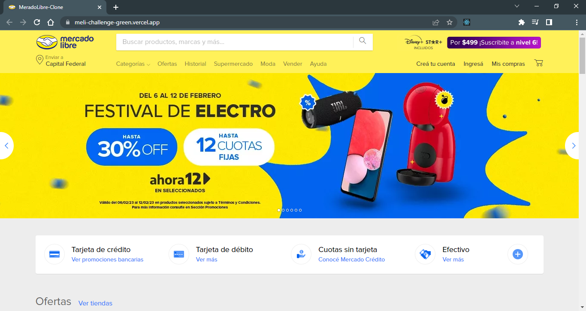
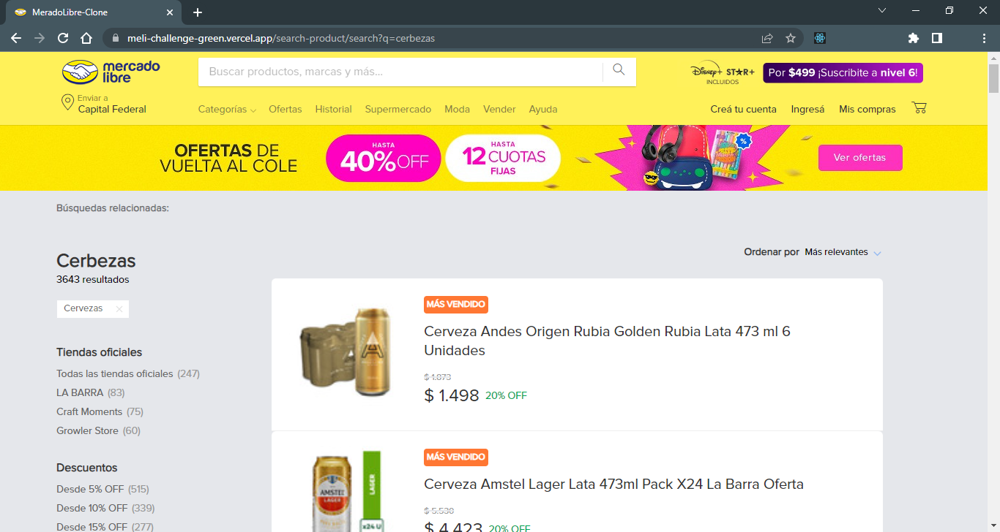
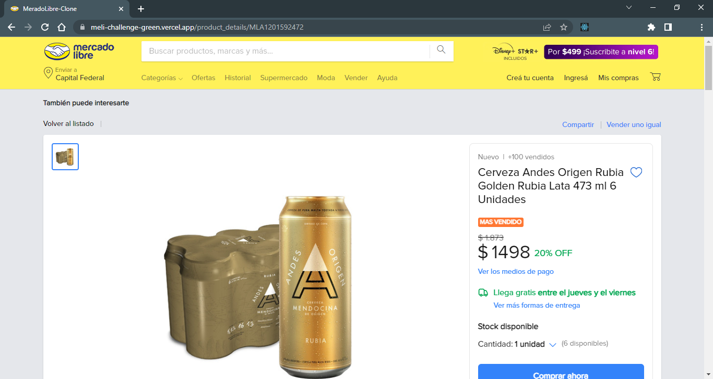

# Clon Mercado Libre

Proyecto  realizado en base al challenge de MercadoLibre, pero en esta ocasión se realizó un clon de la página principal de MercadoLibre y se consumió su API (https://developers.mercadolibre.com.ar/) para darle algunas funcionalidades.

#### Las principales funciones de aplicación son:
* Busqueda de artículos.
* Vista con los resultados de la búsqueda.
* Detalle del artículo.
* Filtrar Productos.

#### Proyecto realizado con:
* React
* React Router
* Tailwind CSS

## Como ejecutar la aplicación:

#### 1 - Clonar el repositorio

    git clone https://github.com/FdR-23/Clon-Meli.git

#### 2 - Instalar dependencias

    cd ../Clon Meli/client
    npm install

#### 3 - Iniciar servidor 
    npm run start

# Author
 **Federico Rampi** 
*  <a href="https://portfolio-fdr.vercel.app/" target=”_blank”>Portfolio </a>
*  <a href="https://www.linkedin.com/in/federico-rampi/" target=”_blank”>LinkedIn </a>